# Хеш таблица

## Введение

Эта программа реализуете такую структуру данных как [Хеш таблица](https://ru.wikipedia.org/wiki/%D0%A5%D0%B5%D1%88-%D1%82%D0%B0%D0%B1%D0%BB%D0%B8%D1%86%D0%B0) с методом разрешения коллизий с помощью списка,
проводит сравнение разных алгоритмов хеширования по заселённости создаваемой ими хеш таблицы, а также демонстрирует 3 разных способа ассемблерных оптимизаций алгоритма поиска по хэш таблице.

В качестве элементов хеш таблицы будут выступать английские слова.

## Особенности системы

Тестирование на производительность выполнялось на процессоре **Intel I5-7300HQ**, который поддерживает SIMD инструкции стандарта AVX2 и ниже.
Это означает, что процессор может выполнять векторные инструкции над 256 битами данных одновременно. 

> [!WARNING]
> Программа вовсе не скомпилируется, если ваш процессор не поддерживает SIMD инструкций стандарта AVX2. 

## Скачивание и установка

### Скачивание

В первую очередь нужно выполнить клонирование репозитория на свой компьютер выполнив следующую команду:

``` bash
git clone --recurse-submodules https://github.com/dmitry131131/SIMD_project.git
```

### Сборка

Для сборки выполните команду:
```bash
make
```

## Особенности тестирования производительности

В качестве инструмента тестирования будем использовать [Callgrind](https://valgrind.org/docs/manual/cl-manual.html) (Это составная часть [valgrind](https://ru.wikipedia.org/wiki/Valgrind)). И в качестве визуализатора данных будем использовать [kcachgrind](https://kcachegrind.sourceforge.net/html/Home.html).
Эта программа позволяет наглядно визуализировать деревья вызовов функций и время исполнения каждой.

В расчет будем принимать количество инструкций, выполненных за вызов той или иной функции, а также процентное соотношение времени выполнения той или иной части программы относительно всей программы или конкретной функции.

# Исследование различных хеш функций

В этом пункте будем рассматривать **7** различных функций хеширования:

1.  Константа (return 0)
2.  ASCII код первой буквы в слове
3.  Длина слова
4.  Контрольная сумма всех ASCII кодов слова
5.  Контрольная сумма всех ASCII кодов слова делить на длину слова
6.  [ROR](https://ru.wikipedia.org/wiki/%D0%A1%D0%BA%D0%BE%D0%BB%D1%8C%D0%B7%D1%8F%D1%89%D0%B8%D0%B9_%D1%85%D0%B5%D1%88) хеш
7.  [CRC32](https://ru.m.wikipedia.org/wiki/%D0%A6%D0%B8%D0%BA%D0%BB%D0%B8%D1%87%D0%B5%D1%81%D0%BA%D0%B8%D0%B9_%D0%B8%D0%B7%D0%B1%D1%8B%D1%82%D0%BE%D1%87%D0%BD%D1%8B%D0%B9_%D0%BA%D0%BE%D0%B4#CRC-32) хеш

## Заселённость хеш таблицы

Для нас при выборе алгоритма хеширования ключевым ключевым пунктом является равномерность распределения данных по ячейкам хеш таблицы.

В нашем случае размер хеш таблицы был подобран так, что load-фактор составляет приблизительно 7-8 элементов на 1 ячейку таблицы. 

1. Константа

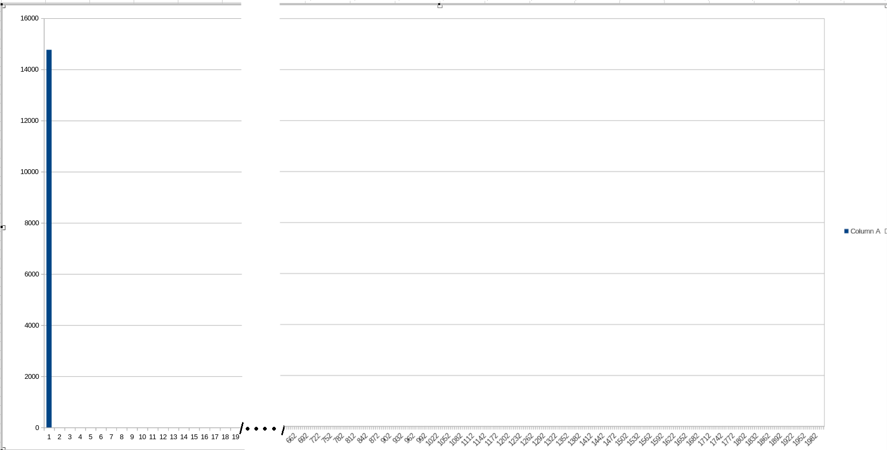

2. ASCII код первой буквы

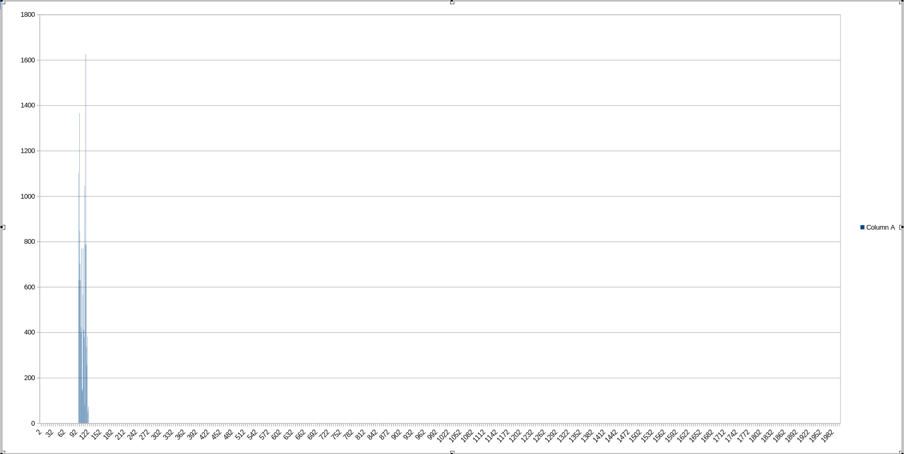

3.  Длина слова

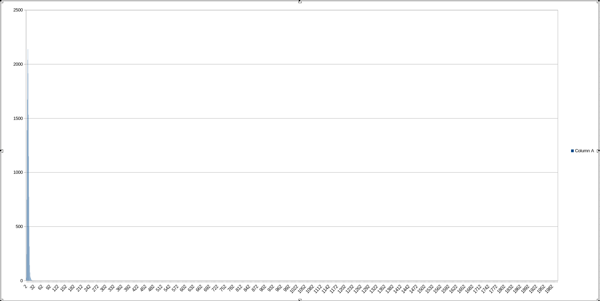

4.  Контрольная сумма всех ASCII кодов слова

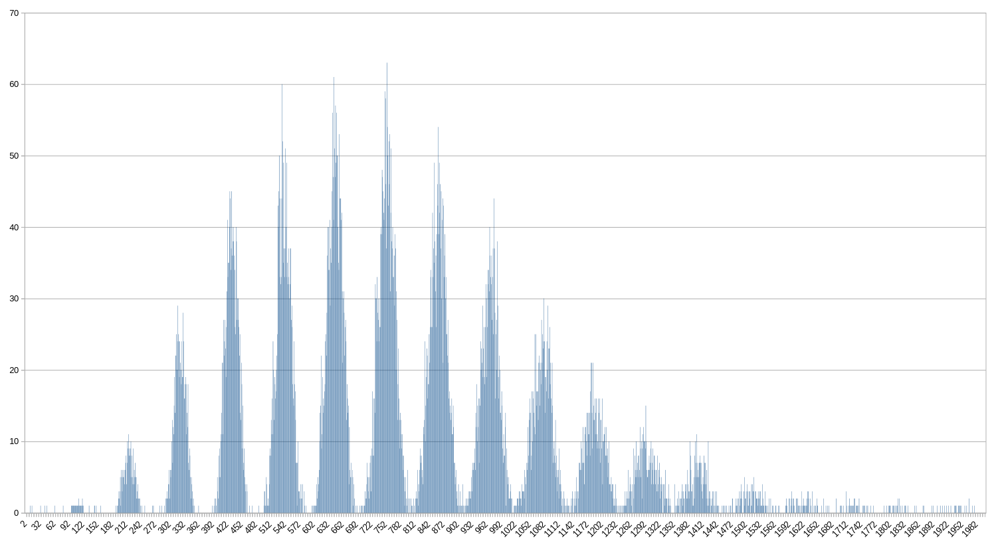

5.  Контрольная сумма всех ASCII кодов слова делить на длину слова

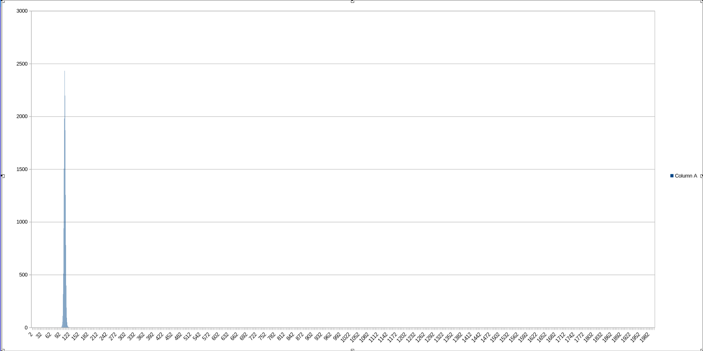

6.  [ROR](https://ru.wikipedia.org/wiki/%D0%A1%D0%BA%D0%BE%D0%BB%D1%8C%D0%B7%D1%8F%D1%89%D0%B8%D0%B9_%D1%85%D0%B5%D1%88) хеш

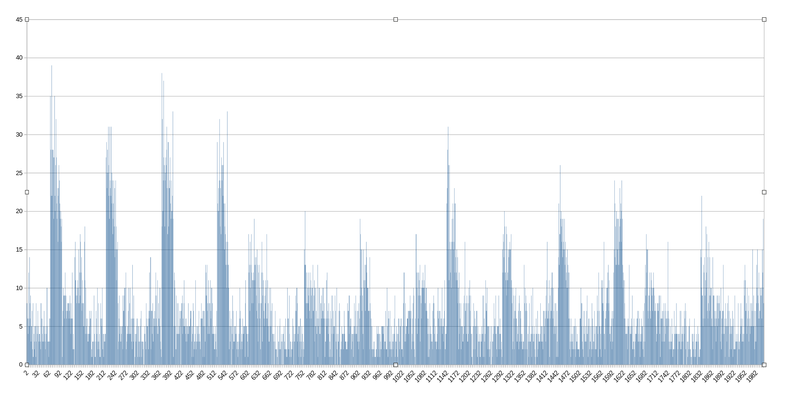

7.  [CRC32](https://ru.m.wikipedia.org/wiki/%D0%A6%D0%B8%D0%BA%D0%BB%D0%B8%D1%87%D0%B5%D1%81%D0%BA%D0%B8%D0%B9_%D0%B8%D0%B7%D0%B1%D1%8B%D1%82%D0%BE%D1%87%D0%BD%D1%8B%D0%B9_%D0%BA%D0%BE%D0%B4#CRC-32) хеш

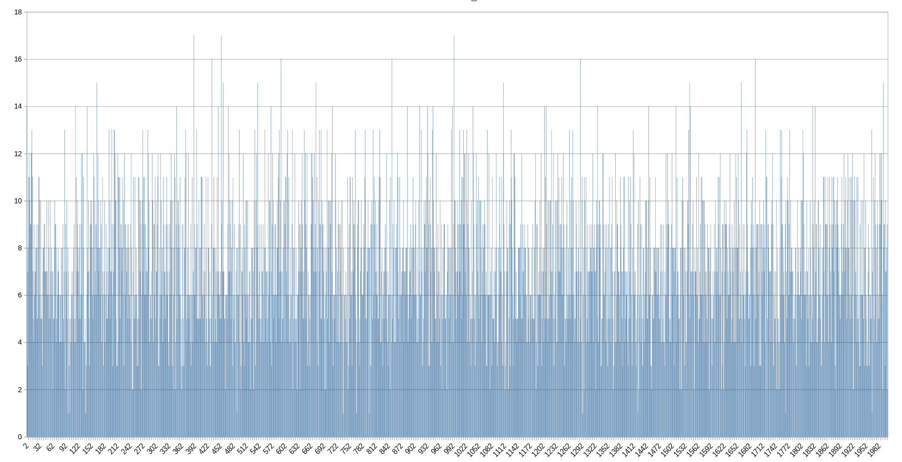

## Дисперсия заселённости
|             Алгоритм           |   Дисперсия   | 
|--------------------------------|---------------|
| (1) Константа                  | 108992        |
| (2) ASCII первой буквы         | 6242          |
| (3) Длина слова                | 11131         |
| (4) Контрольная сумма          | 143           |
| (5) Контрольная сумма / Длину  | 11979         |
| (6) ROR хеш                    | 36            |
| (7) CRC32 хеш                  | 8             |

Как можно заметить лучше всего себя показывает алгоритм crc32. На графике заселённости нет ярко выраженных пиков, как на контрольной сумме и максимальное значение столбца сильно меньше, чем у ror хеша. Из чего можно сделать вывод, что из этих 7 алгоритмов лучше всего выбрать crc32. Также дисперсия crc32 самая маленькая, а это значит, что значения столбцов меньше всего отличаются друг от друга.

### Контрольная сумма на малых размерах хеш таблицы

Однако не стоит считать, что контрольная сумма запрещена к использованию в качестве хэш функции.
Рассмотрим ситуацию(на этом же наборе данных) с меньшим размером хеш таблицы. Вместо продиктованного load-фактором 7-8 возьмём размер в 101 ячейку.

График заселённости для размера в 101 ячейку
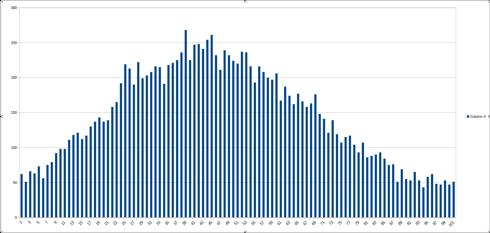

График заселённости для размера в 2001 ячейку


Можно заметить, что для размера хеш таблицы в 101 ячейку контрольная сумма вполне подходящий хеш, потому что он обеспечивает некоторый приемлемый уровень равномерности.
Следовательно при работе с малыми хэш таблицами и малым объёмом данных это хеш вполне можно использовать.

Объясним теперь периодичный характер контрольной суммы на размере в 2001 ячейку. 
Дело в том что ASCII коды строчных английских букв находятся в диапазоне от 97 до 122 следовательно эти пики соответствуют словам состоящих из {1, 2, 3, 4, 5, 6, ... 33} букв. Поскольку максимальная длина слова в выборке данных 33, то хеш может "огибать таблицу 1 раз" это и создаёт шум в самом начале таблицы (в диапазоне от 0 до 97), где в принципе не может быть ни одного ASCII символа

### ROR хеш

Рассмотрим подробнее реализацию алгоритма ror хеша:

```C
size_t ror_hash(const char* str, size_t table_len)
{
    size_t temp_symbol = 0;

    for (size_t i = 0; str[i]; i++)
    {   
        temp_symbol = ((temp_symbol >> 1) | (temp_symbol << (sizeof(temp_symbol) * 8 - 1))) ^ ((size_t) str[i]);
    }

    return temp_symbol % table_len;
}
```

Фактически вся функциональная часть алгоритма - циклический сдвиг вправо, который написан с помощью побитовых операций.

Интересно увидеть как компилятор оптимизирует этот участок кода.
Запустим компилятор с флагом `-O0` и посмотрим во что скомпилируется функция

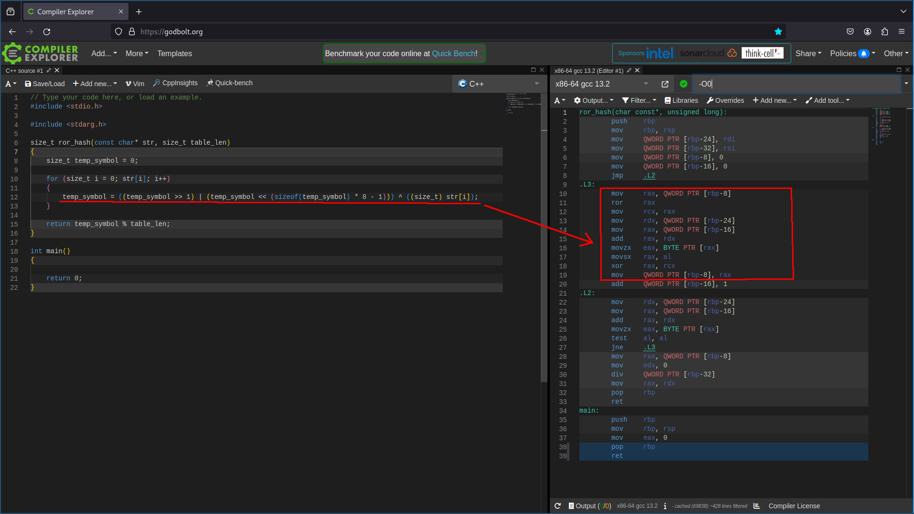

Как мы видим компилятор напрямую транслировал всё, что написано на языке С

Теперь скомпилируем программу с флагом `-O3` и посмотрим на этот же участок листинга

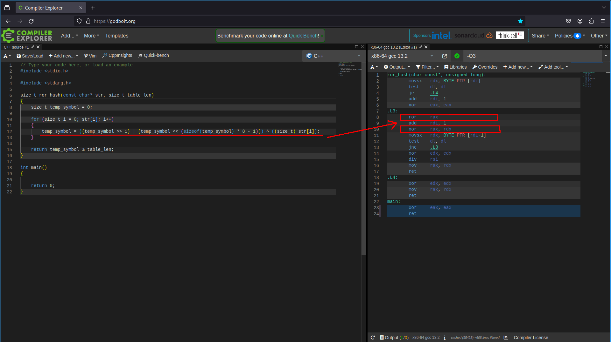

Видно, что компилятор увидел в программе на С циклический сдвиг и применил замену на более эффективную инструкцию.

Интересно, что подобного рода оптимизации компилятор выполняет даже с ключом `-O1`

## Подытог

Оценив качество и особенности 7 различных хеш функций можно сделать вывод, что наиболее предпочтительная функция - crc32
Её мы и будем использовать в следующие части работы. 

# Тест производительности и ассемблерные оптимизации

В качестве теста производительности будем 100000 раз искать слова в хеш таблице, слова возьмём из буфера, из которого заполняли хеш таблицу.

Компилировать программу будем с флагами `-march=native -g -O3 -DNDEBUG`.
+ `-march=native` для компиляции SIMD инструкций
+ `-g` для корректной работы профилировщика
+ `-O3` для оптимизации компилятором
+ `-DNDEBUG` для отключения assert

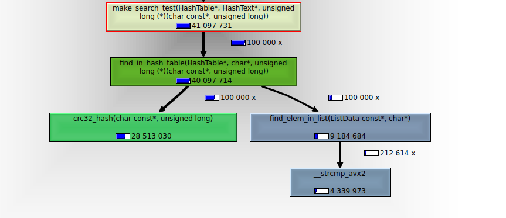

Как можно заметить функция поиска вызывает 2 функции:
+ Подсчёта хеша
+ Линейный поиск по списку

Причём собственное время выполнения функции по сравнению с этими двумя ничтожно мало(на данном этапе).

## Intrinsic оптимизация

Начнём оптимизацию с самого очевидного места - **хеш функции**, потому что время её работы составляет большую часть от времени выполнения функции поиска.

До оптимизации количество выполненных команд в функции подсчёта хеша составляет `29 миллионов`, а общее количество команд в функции поиска составляет `40 миллионов`

Используем intrinsic функцию стандарта SSE4.2 - `_mm_crc32_u8()` в качестве функции подсчёта хеша.
Заменим ей внутренний цикл в наивном алгоритме, это должно значительно ускорить время работы и уменьшить количество выполняемых команд:

```C
size_t crc32_hash_simd(const char* str, size_t table_len)
{
    unsigned int crc = 0xFFFFFFFF;

    for (size_t i = 0; str[i]; i++)
    {
        crc = _mm_crc32_u8(crc, str[i]);
    }

    return (size_t) crc % table_len;
}
```

Теперь ещё раз произведём тестирование:

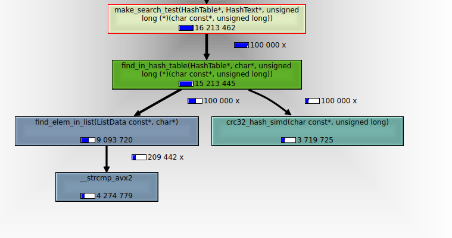

Как видно время выполнения функции хеширования значительно сократилось и теперь составляет всего `20%` от всего времени выполнения функции поиска.

Теперь количество выполненных команд в этой функции составляет всего `4 миллиона`, это в *7.25* раз меньше, а значит гораздо быстрее. В свою очередь количество команд в функции поиска упало с `40 миллионов` до `15 миллионов`.

> [!WARNING]
> Важно отметить, что количество выполненных команд считается не для 1 функции подсчёта хеша, а для 100000, потому что функция поиска вызывается 100000 раз.

## Оптимизация поиска по списку

Как видно из последнего графа, следующая функция, требующая оптимизации - линейный поиск по списку. А большая часть производительности теряется на функции сравнения строк, значит именно её и следует оптимизировать.

Заметим, что длина 1 строки в нашем наборе данных не превышает 32 символа, а значит можно поместить каждое слово в ячейки по 32 байта и сравнивать области памяти, а не строки разной длины. Это будет гораздо быстрее, чем вызов стандартной функции `strcmp()`.

Функциональная часть функции выглядит следующим образом
В качестве параметров будем передавать два сравниваемых `__m256i`
```asm

vpcmpeqb        ymm0, ymm1, ymm0
vpmovmskb       eax, ymm0
not     eax

```

Выполним эту функцию на ассемблере в отдельном файле и будем вызывать из функции `find_elem_in_list_custom()`.

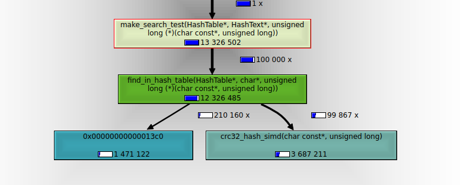

Как видно компилятор поместил всю функцию `find_elem_in_list_custom()`, кроме функции сравнения строк напрямую в `find_in_hash_table()`.
В результате этой оптимизации количество операций сократилось с `15 миллионов` до `12 миллионов`, что является хорошим результатом.

## Оптимизация strcmp через встроенный ассемблер

Но предыдущая оптимизация не является пределом, ведь как видно из графа компилятор не смог встроить функцию напрямую в код и это породило много накладных расходов, связанных с её вызовом. А поскольку эта функция вызывается очень часто, то вносит ощутимый вклад в производительность.

Выходом является встраивание ассемблерного кода напрямую в функцию `find_elem_in_list_custom()` с помощью встроенного ассемблера, что даст ощутимый прирост в производительности.

Описанный сегмент кода выглядит следующим образом:

```C
__asm__ (   "vmovdqa   %1, %%ymm0             \n\t"
            "vmovdqa   %2, %%ymm1             \n\t"
            "vpcmpeqb  %%ymm0, %%ymm1, %%ymm0 \n\t"
            "vpmovmskb %%ymm0, %%eax          \n\t"
            "notl      %%eax                  \n\t"
            "movl      %%eax, %0              \n\t"
        :"=m"(out)
        :"m"(*element_data), "m"(*str_data)
        :"%eax"
        );
```

Фактически этот код мало чем отличается от кода из предыдущего пункта, за исключением того, что приходится вручную пересылать данные из оперативной памяти в ymm регистры.

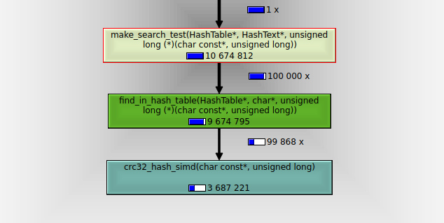

Как можно заметить, количество операций в функции `find_elem_in_list_custom()` снизилось с `12` миллионов до `9` миллионов. Что только подтверждает важность учёта накладных расходов при проектировании приложения.

## Inline оптимизация

До этого момента все функции, которые вызывались из функции поиска не были намеренно сделаны `inline`, потому что для сохранения логичности архитектуры программы функции хеширования, поиска и тестирования находились в разных файлах. Теперь ради эксперимента перенесём функцию хеширования в файл с функцией поиска и сделаем её `inline`.

Проведём тестирование

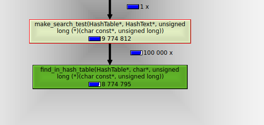

Как видно компилятор встроил код функции хеширования напрямую в функцию поиска и время количество операций сократилось с `9,7 миллионов` до `8,8 миллионов`. Что ещё раз доказывает существенность влияния накладных расходов на вызов функций.

# Вывод

В результате проведённых оптимизаций можно составить сравнительную характеристику каждой из них.

|           Оптимизация          |   Количество операций, $10^6$   | Прирост относительно не оптимизированной версии |
|--------------------------------|---------------------------------|-------------------------------------------------|
| Нет оптимизаций                | 40,0                            |                        1                        |
| Intrinsic оптимизация crc32    | 15,2                            |                        2,63                     |
| strcmp в отдельном .s файле    | 12,3                            |                        3,25                     |
| strcmp во встроенном коде      | 9,7                             |                        4,12                     |
| crc32 inline                   | 8,8                             |                        4,55                     |

Как показывает эта таблица, оптимизации для конкретных архитектур и для конкретных частных случаев даёт большой прирост в производительности, однако разрушает переносимость и в некоторых случаях и читаемость кода. Поэтому к подобного рода оптимизациям стоит прибегать только в случаях, где это действительно необходимо.

Однако inline оптимизации не нарушают переносимость и ускоряют программу, но при этом страдает логичность архитектуры приложения и исполняемый файл становится более массивным, поэтому такие оптимизации стоит проделывать по необходимости с функциями малого размера, которые вызываются в малом количестве различных мест программы.